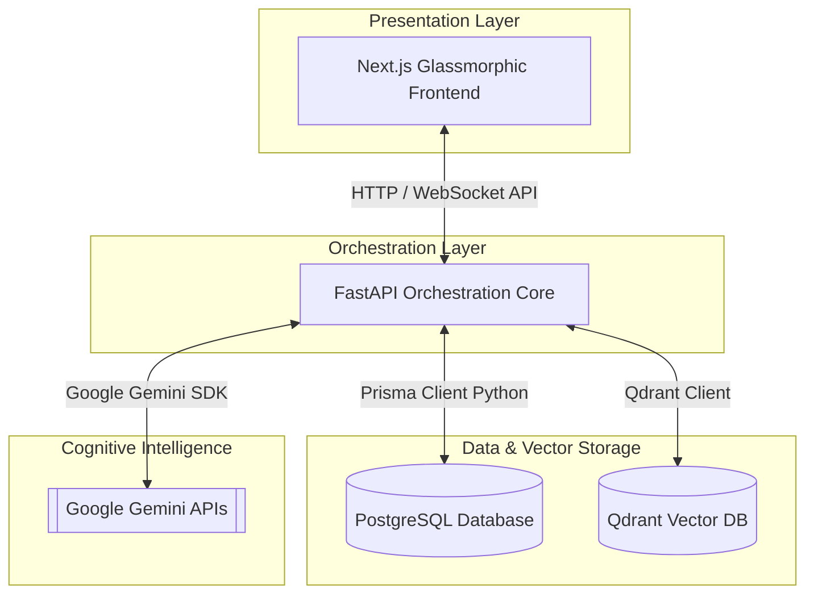

# ⚡ Project Summary: Vectora

Vectora adalah sebuah **Control Plane Administrasi & Orkestrasi RAG (Retrieval-Augmented Generation) Berkinerja Tinggi** tingkat enterprise. Platform ini dirancang untuk mempermudah AI engineer, security researcher, dan web developer dalam mengonfigurasi, memantau, dan mengoptimalkan siklus hidup data kognitif serta pipeline pencarian semantik tanpa harus berinteraksi dengan antarmuka baris perintah (CLI) secara manual.

Proyek ini mengadopsi pendekatan desain **glassmorphism** modern yang dinamis (Synthetic Intelligence Interface) untuk menyajikan antarmuka pengguna yang responsif, dilengkapi visualisasi chunk, telemetry log real-time, sandbox playground, dan pengelolaan model AI terpusat.

---

## 🏗️ Topologi Arsitektur Sistem

Sistem Vectora dirancang dengan pendekatan *decoupled* yang memisahkan tanggung jawab antarmuka, orkestrasi logika, database relasional, engine vektor, dan kecerdasan kognitif LLM:



### Penjelasan Lapisan Arsitektur:
1. **Presentation Layer (Next.js)**: Menyediakan antarmuka modular bergaya glassmorphism untuk manajemen dokumen, eksplorasi data chunk, pengujian RAG, pemantauan model AI, dan visualisasi aktivitas log sistem.
2. **Orchestration Core (FastAPI)**: Mengatur API RESTful secara asinkron, memproses penyerapan berkas secara non-blocking (*background tasks*), memformat prompt, dan mengoordinasikan interaksi antara database relasional dan database vektor.
3. **Vector Indexing Engine (Qdrant)**: Bertanggung jawab menyimpan dan mengindeks embedding semantik dengan dimensi 768. Mendukung mode transient in-memory (`:memory:`) untuk fase pengembangan dan cluster Qdrant Cloud untuk produksi.
4. **Relational Metadata Layer (PostgreSQL & Prisma)**: Digunakan untuk mencatat skema relasional terstruktur seperti metadata dokumen, relasi dokumen-chunk, riwayat kueri pengguna (latency & token), serta registri model aktif.
5. **Cognitive Reasoning Layer (Google Gemini)**: Menggunakan model `text-embedding-004` untuk mengubah dokumen menjadi representasi numerik dan `gemini-3.1-flash-lite` untuk menyintesis jawaban akhir berbasis dokumen secara akurat.

---

## 🛠️ Tech Stack & Spesifikasi

### Frontend
- **Framework**: Next.js 15+ (App Router, TypeScript)
- **Styling**: Vanilla CSS & Tailwind CSS (Custom glassmorphism theme)
- **Desain**: Sistem komponen modular dari StitchMCP dengan fokus visual estetis yang premium.

### Backend & API
- **Framework**: FastAPI (Python 3.10+)
- **ORM & Database Client**: Prisma Client Python (`prisma-client-py` berbasis `asyncio`)
- **Pipeline Orchestrator**: LangChain (untuk chunking rekursif dan penanganan model)
- **Task Queue**: FastAPI BackgroundTasks untuk ingestion dokumen asinkron.

### Database & Storage
- **Metadata Database**: PostgreSQL (Diintegrasikan dengan Prisma ORM)
- **Vector Database**: Qdrant Vector Engine (Menggunakan metric Cosine Distance)

---

## 🗄️ Skema Database Relasional (Prisma Models)

Metadata sistem dipetakan secara relasional menggunakan Prisma ORM dalam berkas `schema.prisma`. Berikut adalah pemodelan data saat ini:

### 1. Model `Document`
Menyimpan metadata dasar dari file sumber knowledge base yang diunggah.
```prisma
model Document {
  id         String   @id @default(uuid())
  filename   String
  source     String?
  size       Int
  status     String   @default("pending") // pending, processing, completed, failed
  created_at DateTime @default(now())
  updated_at DateTime @updatedAt
  chunks     Chunk[]

  @@map("documents")
}
```

### 2. Model `Chunk`
Menyimpan potongan teks hasil splitting dokumen asli berserta metadata token dan referensi embedding.
```prisma
model Chunk {
  id           String   @id @default(uuid())
  document_id  String
  document     Document @relation(fields: [document_id], references: [id], onDelete: Cascade)
  content      String
  token_count  Int
  chunk_index  Int
  embedding_id String?
  created_at   DateTime @default(now())

  @@map("chunks")
}
```

### 3. Model `QueryLog`
Mencatat statistik performa dan riwayat percakapan/kueri RAG untuk kebutuhan audit dan pemantauan sistem.
```prisma
model QueryLog {
  id         String   @id @default(uuid())
  question   String
  response   String
  latency    Float
  created_at DateTime @default(now())

  @@map("query_logs")
}
```

### 4. Model `AIModel`
Mendaftarkan model-model AI yang didukung baik untuk LLM maupun Embedding (seperti Gemini, Ollama, LM Studio).
```prisma
model AIModel {
  id           String   @id @default(uuid())
  provider     String   // gemini, ollama, openai
  model_name   String
  type         String   // llm, embedding
  status       String   @default("active")
  dimension    Int?     // e.g. 768 untuk text-embedding-004
  api_endpoint String?
  created_at   DateTime @default(now())

  @@map("models")
}
```

### 5. Model `VectorDB`
Mengonfigurasi koneksi ke instance Vector Database eksternal atau lokal.
```prisma
model VectorDB {
  id                String   @id @default(uuid())
  name              String
  provider          String   // qdrant, chromadb
  url               String?
  api_key           String?
  status            String   @default("inactive")
  active_collection String   @default("vectora_documents")
  created_at        DateTime @default(now())

  @@map("vector_dbs")
}
```

---

## ⚡ Alur Pipeline RAG

Platform Vectora menjalankan dua pipeline utama untuk mewujudkan RAG yang andal:

### 1. Ingestion Pipeline (Proses Penyerapan Dokumen)

```
[Unggah Dokumen .txt/.md] 
       │
       ▼
[FastAPI Non-blocking Queue] (Task dilempar ke background agar UI tetap responsif)
       │
       ▼
[Recursive Text Splitting] (Memotong teks menjadi chunk berukuran 1000 karakter, overlap 200)
       │
       ▼
[Vector Generation] (Mengirimkan chunk teks ke Google Gemini 'text-embedding-004' -> Vektor 768d)
       │
       ▼
[Vector & Metadata Storage] 
 ├──> Simpan Vektor ke Qdrant Collection ('vectora_documents' via Cosine metric)
 └──> Sinkronisasi metadata relasional ke PostgreSQL (Status diubah ke 'completed')
```

### 2. Query & Synthesis Pipeline (Pencarian & Konstruksi Jawaban)

```
[Pertanyaan Pengguna]
       │
       ▼
[Query Vectorization] (Mengonversi kueri ke representasi vektor 768d menggunakan text-embedding-004)
       │
       ▼
[K-NN Semantic Search] (Membandingkan vektor kueri dengan koleksi Qdrant menggunakan kesamaan Cosine)
       │
       ▼
[Context Retrieval] (Mengambil top-k potongan teks paling relevan beserta dokumen sumbernya)
       │
       ▼
[Prompt Augmentation] (Membangun prompt kaya konteks dengan menyisipkan chunk yang relevan)
       │
       ▼
[Grounded LLM Synthesis] (Model 'gemini-3.1-flash-lite' menyintesis jawaban yang terfokus pada data)
       │
       ▼
[Telemetry Logging] (Latensi total, referensi dokumen, skor kecocokan, & jawaban disimpan di QueryLog)
```

---

## 🖥️ Halaman Antarmuka Web (UI Pages)

Next.js frontend dirancang dengan struktur menu sidebar modular yang memberikan kendali penuh terhadap siklus RAG:

| Nama Halaman | Route | Fungsi Utama |
|---|---|---|
| **Dashboard** | `/` | Menampilkan ringkasan status sistem, jumlah dokumen, total vektor yang diindeks, status model aktif, grafik latensi kueri rata-rata, dan pemantauan aktivitas terkini. |
| **Documents** | `/documents` | Manajemen *Knowledge Base* (CRUD berkas). User dapat mengunggah berkas teks, melihat status pengindeksan, melakukan re-index ulang, dan menghapus dokumen beserta vektor terkait. |
| **Chunks** | `/chunks` | Eksplorasi detail potongan teks (*chunk level inspector*). Berguna untuk menganalisis pemotongan kalimat, jumlah token per chunk, serta memverifikasi tumpang-tindih teks (*overlap*). |
| **Playground** | `/playground` | Sandbox pengujian RAG secara real-time. Memungkinkan pengguna mengubah konfigurasi *Top-K* dan *Temperature*, melihat prompt yang di-generate, memeriksa skor kemiripan, serta menelusuri latensi. |
| **Models** | `/models` | Pusat administrasi model AI. Memfasilitasi pendaftaran provider model (Gemini, Ollama, API kompatibel OpenAI) serta memverifikasi status koneksinya (*health check*). |
| **Logs** | `/logs` | Konsol pemantauan log sistem terpadu. Menyajikan log penyerapan data (*ingestion*), log kueri, dan pelacakan kesalahan (*error logs*) secara mendalam. |

---

## 🚀 Langkah Menjalankan Aplikasi di Lokal

### 🛠️ Persyaratan Awal
- Python 3.10 ke atas
- Node.js v18 ke atas (dengan manajer paket `pnpm`)
- Kunci API Google AI Studio (Gemini)

### 1. Inisialisasi & Menjalankan Backend
1. Masuk ke direktori backend:
   ```bash
   cd backend
   ```
2. Buat dan aktifkan *virtual environment* Python:
   ```bash
   python3 -m venv venv
   source venv/bin/activate
   ```
3. Instal dependensi library yang dibutuhkan:
   ```bash
   pip install -r requirements.txt
   ```
4. Jalankan migrasi Prisma untuk menyiapkan database:
   ```bash
   prisma db push
   ```
5. Konfigurasikan berkas `.env` dengan memasukkan `GEMINI_API_KEY`, lalu jalankan server FastAPI:
   ```bash
   python3 app/main.py
   ```
   *Interactive API documentation* akan tersedia di `http://localhost:8000/docs`.

### 2. Menjalankan Frontend Next.js
1. Masuk ke direktori frontend:
   ```bash
   cd frontend
   ```
2. Instal seluruh dependensi frontend:
   ```bash
   pnpm install
   ```
3. Jalankan server pengembangan Next.js:
   ```bash
   pnpm dev
   ```
   Aplikasi dashboard Vectora akan aktif dan dapat diakses melalui browser di `http://localhost:3000`.

---

## 📈 Parameter Keberhasilan & Mitigasi Risiko

- **Target Keberhasilan**:
  - Tingkat keberhasilan penyerapan berkas (*upload success rate*) > 95%.
  - Latensi kueri pencarian semantik & sintesis jawaban < 5 detik.
  - Keakuratan retrieval data kognitif (*retrieval relevance*) > 80%.
- **Mitigasi Risiko**:
  - **Penyerapan File Besar**: Menggunakan antrean asinkron (*FastAPI BackgroundTasks*) untuk mencegah kemacetan HTTP thread utama.
  - **Keterbatasan Kunci API Gemini**: Fallback cerdas berupa *mock vector generator* dan *mock answer generator* akan menyala jika API Key tidak terdeteksi, memastikan pengujian lokal tetap berjalan lancar.
  - **Kerusakan Index Vektor**: Setiap chunk metadata direkam silang di PostgreSQL guna mempermudah proses pembuatan ulang indeks semantik jika terjadi ketidaksesuaian data.

---

## 🚀 Rencana Pengembangan Fitur Produksi (Project Plan)

Bagian ini memetakan langkah-langkah konkret untuk menstandardisasi platform Vectora dari fase pengembangan lokal berbasis *fallback/mock* menuju lingkungan **produksi siap pakai (Production-Grade)**. Rencana ini dibagi menjadi dua inisiatif utama: pembangunan **Knowledge Graph Playground versi Produksi** dan **Migrasi Fitur Mock/Fallback ke Sistem Produksi Terdistribusi**.

### 1. 🌐 Inisiatif Utama: Production-Grade Knowledge Graph Playground

Saat ini, visualisasi graf relasional pada RAG masih menggunakan data tiruan statis (*mock graph*). Untuk membawanya ke tahap produksi yang dinamis dan riil, berikut adalah peta jalan implementasinya:

#### A. Lapisan Database & Relasi (PostgreSQL & Prisma)
- **Ekstensi Skema Database**: Membuat model relasional baru di `schema.prisma` untuk menyimpan entitas (*nodes*) dan hubungan (*edges*) hasil ekstraksi dokumen nyata secara dinamis.
  ```prisma
  model Entity {
    id          String   @id @default(uuid())
    name        String   @unique
    type        String   // e.g. Person, Organization, Location, Concept, Software
    description String?
    created_at  DateTime @default(now())
    source_id   String?  // Referensi ke Document id
    
    // Hubungan ke Edges
    source_relations TargetRelation[] @relation("SourceEntity")
    target_relations TargetRelation[] @relation("TargetEntity")
    
    @@map("graph_entities")
  }

  model TargetRelation {
    id          String   @id @default(uuid())
    source_id   String
    target_id   String
    source      Entity   @relation("SourceEntity", fields: [source_id], references: [id], onDelete: Cascade)
    target      Entity   @relation("TargetEntity", fields: [target_id], references: [id], onDelete: Cascade)
    relation    String   // e.g. implements, extracts, utilizes, powers
    description String?
    created_at  DateTime @default(now())

    @@unique([source_id, target_id, relation])
    @@map("graph_relations")
  }
  ```
- **Migrasi Database**: Menjalankan migrasi produksi (`prisma migrate deploy`) untuk mengaplikasikan tabel graf relasional ini ke kluster PostgreSQL produksi.

#### B. Engine Ekstraksi Berbasis LLM (FastAPI & Gemini)
- **Ekstraksi Triplet Semantik Otomatis**: Mengembangkan modul ekstraktor di `backend/app/services/graph_service.py` memanfaatkan Google Gemini API (`gemini-3.1-flash-lite` dengan *Structured JSON Output*).
- **Prosedur Pipeline**:
  1. Selama penyerapan dokumen scraping (JSON, XML, CSV), setelah teks di-chunk, kirimkan potongan teks ke Gemini.
  2. Instruksikan Gemini untuk mengekstrak entitas kunci beserta jenisnya, dan mendeteksi relasi antar-entitas tersebut.
  3. Format output harus mematuhi skema JSON:
     ```json
     {
       "entities": [{"name": "NamaEntitas", "type": "Jenis"}, ...],
       "relations": [{"source": "EntitasA", "target": "EntitasB", "relation": "tipe_relasi"}]
     }
     ```
  4. Lakukan pembersihan dan penyimpanan entitas & relasi ke PostgreSQL menggunakan kueri transaksi Prisma (upsert entitas, kemudian masukkan relasi unik).
- **Graph RAG Query Routing**: Ketika kueri diajukan di playground RAG, ambil entitas yang cocok di database graf relasional, gabungkan sub-graf tetangga (context graph), dan sajikan sebagai konteks tambahan bersama dengan chunk dari database vektor untuk dikirim ke LLM.

#### C. Antarmuka Interaktif Premium (Next.js Frontend)
- **Visualisasi D3 Graf Riil**: Menghubungkan visualisasi D3.js di `/playground` secara dinamis ke endpoint API backend `/api/graph/nodes` dan `/api/graph/edges` yang merefleksikan data riil dari PostgreSQL.
- **Fitur Interaktif Tingkat Lanjut**:
  - **Filter Entitas**: Memungkinkan pengguna memfilter visualisasi graf berdasarkan tipe entitas (misal: hanya menampilkan entitas bertipe `Software` atau `Concept`).
  - **Pencarian Graf**: Input pencarian untuk menyorot node tertentu di kanvas D3.
  - **Editor Hubungan Manual**: Mengaktifkan modal interaktif untuk menambahkan, mengedit, atau menghapus entitas dan relasi secara manual dari GUI untuk kebutuhan pembersihan basis pengetahuan (*knowledge curation*).

---

### 2. 🔌 Strategi Migrasi Fitur Mock/Fallback ke Sistem Produksi

Berikut adalah cetak biru teknis untuk mengganti 6 mekanisme fallback cerdas di lingkungan pengembangan lokal menjadi fungsionalitas produksi sejati yang tangguh:

#### A. Transisi dari Mock Embedding ke Produksi
- **Validasi Kunci API Wajib**: Mengubah parameter konfigurasi backend agar membatasi pendaftaran dokumen jika `GEMINI_API_KEY` tidak terdeteksi atau tidak valid.
- **Manajemen Embedding Skala Besar**: Menggunakan model `text-embedding-004` (dimensi 768) secara penuh dan mengaktifkan kueri batching untuk memproses ribuan chunk secara efisien tanpa terkena limitasi API (rate limiting).

#### B. Transisi dari Mock LLM Response ke Produksi
- **Optimasi Sintesis Respons**: Menerapkan modul pengiriman jawaban secara *streaming* (`StreamingResponse` di FastAPI dan *Server-Sent Events* / SSE di Next.js) agar respons sintesis jawaban Gemini dapat dimunculkan kata-per-kata secara real-time demi pengalaman pengguna yang premium.
- **Sistem Evaluasi Groundedness**: Menambahkan sistem penilaian otomatis (seperti cosine similarity check antara kueri, jawaban LLM, dan source chunk pendukung) guna memverifikasi kebenaran data dan menghindari halusinasi model.

#### C. Migrasi Database Relasional ke PostgreSQL Cloud
- **Penyimpanan Terdistribusi**: Menghentikan in-memory SQLite fallback pada lingkungan produksi dan mengarahkannya ke PostgreSQL cloud terkelola (seperti Supabase atau AWS RDS).
- **Pooling Koneksi**: Mengonfigurasi pooling koneksi database menggunakan pgBouncer untuk mengatasi kueri konkurensi tinggi dari server FastAPI.

#### D. Migrasi Vector Store ke Qdrant Produksi
- **Kluster Qdrant Cloud**: Mengganti fallback in-memory `:memory:` dengan koneksi terenkripsi ke kluster Qdrant Cloud yang aman menggunakan REST API Key.
- **Konfigurasi Indeks Efisien**: Menyusun setelan indexing di Qdrant (mengaktifkan HNSW indexing dan payload indexing pada ID dokumen) guna menjamin performa pencarian semantik sub-detik bahkan saat ukuran data mencapai jutaan vektor.

